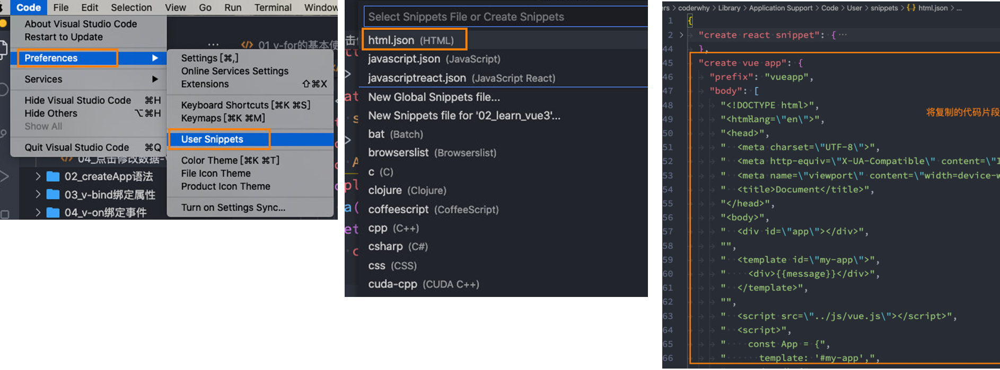
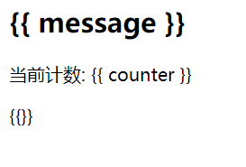

# 内容回顾

## 一. 邂逅Vue.js开发

### 1.1. Vue介绍

* Vue的介绍
* Vue在前端的地位
  * react
  * angular

* 直接学习Vue3


### 1.2. Vue下载和使用

* CDN引入
* 下载引入
* 初体验一下Vue开发


### 1.3. Vue的三个案例

#### 1.3.1. 动态数据展示


#### 1.3.2. 动态展示列表

* v-for


#### 1.3.3. 计数器案例

* counter
* increment
* decrement


### 1.4. 命令式和声明式编程的区别

* 原生实现计时器


### 1.5. MVC和MVVM的模型区别


### 1.6. options api的data详解

* data必须是一个函数, 函数会返回一个对象
* data返回的对象, 会被Vue进行劫持(放到响应式系统中), 所以data的数据发生改变时, 界面会重新渲染


### 1.7. options api的methods详解

* 对象 -> 很多函数
* 里面函数不能是箭头函数:
  * this


## 二. 基础 - 模板语法

### 2.1. 添加代码片段

* 第一步，复制自己需要生成代码片段的代码；

* 第二步，https://snippet-generator.app/在该网站中生成代码片段；

* 第三步，在VSCode中配置代码片段；

  

### 2.2. mustache语法(插值语法)

* 表达式

  ```html
  <html lang="en">
  <head>
    <meta charset="UTF-8">
    <meta http-equiv="X-UA-Compatible" content="IE=edge">
    <meta name="viewport" content="width=device-width, initial-scale=1.0">
    <title>Document</title>
  </head>
  <body>
  
    <div id="app">
      <!-- 1.基本使用 -->
      <h2>{{ message }}</h2>
      <h2>当前计数: {{ counter }} </h2>
  
      <!-- 2.表达式 -->
      <h2>计数双倍: {{ counter * 2 }}</h2>
      <h2>展示的信息: {{ info.split(" ") }}</h2>
  
      <!-- 3.三元运算符 -->
      <h2>{{ age >= 18? "成年人": "未成年人" }}</h2>
  
      <!-- 4.调用methods中函数 -->
      <h2>{{ formatDate(time) }}</h2>
  
      <!-- 5.注意: 这里不能定义语句 -->
      <!-- <h2>{{ const name = "why" }}</h2> -->
  
    </div>
    
    <script src="../lib/vue.js"></script>
    <script>
      // 1.创建app
      const app = Vue.createApp({
        // data: option api
        data: function() {
          return {
            message: "Hello Vue",
            counter: 100,
            info: "my name is why",
            age: 22,
            time: 123
          }
        },
  
        methods: {
          formatDate: function(date) {
            return "2022-10-10-" + date
          }
        }
      })
  
      // 2.挂载app
      app.mount("#app")
    </script>
  </body>
  </html>
  ```

### 2.3. 不算常用的指令

* v-once 点击只能触发一次

  ```html
  <html lang="en">
  <head>
    <meta charset="UTF-8">
    <meta http-equiv="X-UA-Compatible" content="IE=edge">
    <meta name="viewport" content="width=device-width, initial-scale=1.0">
    <title>Document</title>
  </head>
  <body>
  
    <div id="app">
  
      <!-- 指令: v-once -->
      <h2 v-once>
        {{ message }}
        <span>数字: {{counter}}</span>
      </h2>
  
      <h1>{{message}}</h1>
  
      <button @click="changeMessage">改变message</button>
    </div>
    
    <script src="../lib/vue.js"></script>
    <script>
      // 1.创建app
      const app = Vue.createApp({
        // data: option api
        data: function() {
          return {
            message: "Hello Vue",
            counter: 100
          }
        },
  
        methods: {
          changeMessage: function() {
            this.message = "你好啊, 李银河"
            this.counter += 100
            console.log(this.message, this.counter)
          }
        }
      })
  
      // 2.挂载app
      app.mount("#app")
    </script>
  </body>
  </html>
  ```

  

* v-text 显示v-text里面的内容， 用于更新元素的 textContent

  ```html
  <html lang="en">
  <head>
    <meta charset="UTF-8">
    <meta http-equiv="X-UA-Compatible" content="IE=edge">
    <meta name="viewport" content="width=device-width, initial-scale=1.0">
    <title>Document</title>
  </head>
  <body>
  
    <div id="app">
      <h2> aa {{message}} bbb</h2>
      <h2 v-text="message">aaa</h2>
    </div>
    
    <script src="../lib/vue.js"></script>
    <script>
      // 1.创建app
      const app = Vue.createApp({
        // data: option api
        data: function() {
          return {
            message: "Hello Vue"
          }
        },
      })
  
      // 2.挂载app
      app.mount("#app")
    </script>
  </body>
  </html>
  ```

  

* v-html 显示带有html语法的内容

  ```html
  <html lang="en">
  <head>
    <meta charset="UTF-8">
    <meta http-equiv="X-UA-Compatible" content="IE=edge">
    <meta name="viewport" content="width=device-width, initial-scale=1.0">
    <title>Document</title>
  </head>
  <body>
  
    <div id="app">
      <h2>{{ content }}</h2>
      <h2 v-html="content"></h2>
    </div>
    
    <script src="../lib/vue.js"></script>
    <script>
      // 1.创建app
      const app = Vue.createApp({
        // data: option api
        data: function() {
          return {
            content: `<span style="color: red; font-size: 30px;">哈哈哈</span>`
          }
        },
      })
  
      // 2.挂载app
      app.mount("#app")
    </script>
  </body>
  </html>
  ```

* v-pre  **用于**跳过元素和它的子元素的编译过程，显示原始的**Mustache**标签：

  ```html
  <html lang="en">
  <head>
    <meta charset="UTF-8">
    <meta http-equiv="X-UA-Compatible" content="IE=edge">
    <meta name="viewport" content="width=device-width, initial-scale=1.0">
    <title>Document</title>
  </head>
  <body>
  
    <div id="app">
      <div v-pre>
        <h2>{{ message }}</h2>
        <p>当前计数: {{ counter }}</p>
        <p>{{}}</p>
      </div>
    </div>
    
    <script src="../lib/vue.js"></script>
    <script>
      // 1.创建app
      const app = Vue.createApp({
        // data: option api
        data: function() {
          return {
            message: "Hello Vue",
            counter: 0
          }
        },
      })
  
      // 2.挂载app
      app.mount("#app")
    </script>
  </body>
  </html>
  ```

  

* v-cloak   **这个指令保持在元素上直到关联组件实例结束编译。**

```html
p和 CSS 规则如 [v-cloak] { display: none } 一起用时，这个指令可以隐藏未编译的 Mustache 标签直到组件实例准备完毕。
<html lang="en">
<head>
  <meta charset="UTF-8">
  <meta http-equiv="X-UA-Compatible" content="IE=edge">
  <meta name="viewport" content="width=device-width, initial-scale=1.0">
  <title>Document</title>
  <style>
    [v-cloak] {
      display: none;
    }
  </style>
</head>
<body>

  <div id="app">
    <h2 v-cloak>{{message}}</h2>
  </div>
  
  <script src="../lib/vue.js"></script>
  <script>
    
    setTimeout(() => {
      // 1.创建app
      const app = Vue.createApp({
        // data: option api
        data: function() {
          return {
            message: "Hello Vue"
          }
        },
      })

      // 2.挂载app
      app.mount("#app")
    }, 3000)

  </script>
</body>
</html>
```


###  新的指令 v-memo 

当改变的是v-memo数组里面的内容时，子元素里面的数据才发发生改变

```html
<html lang="en">
<head>
  <meta charset="UTF-8">
  <meta http-equiv="X-UA-Compatible" content="IE=edge">
  <meta name="viewport" content="width=device-width, initial-scale=1.0">
  <title>Document</title>
</head>
<body>

  <div id="app">
    <div v-memo="[name, age]">
      <h2>姓名: {{ name }}</h2>
      <h2>年龄: {{ age }}</h2>
      <h2>身高: {{ height }}</h2>
    </div>
    <button @click="updateInfo">改变信息</button>
  </div>
  
  <script src="../lib/vue.js"></script>
  <script>
    // 1.创建app
    const app = Vue.createApp({
      // data: option api
      data: function() {
        return {
          name: "why",
          age: 18,
          height: 1.88
        }
      },

      methods: {
        updateInfo: function() {
          // this.name = "kobe"
          this.age = 20
        }
      }
    })

    // 2.挂载app
    app.mount("#app")
  </script>
</body>
</html>
```


### 2.5. v-bind绑定属性

#### 2.5.1. v-bind绑定基本属性

* src     比如动态绑定img元素的src属性

* href。比如动态绑定a元素的href属性

  ```html
  <html lang="en">
  <head>
    <meta charset="UTF-8">
    <meta http-equiv="X-UA-Compatible" content="IE=edge">
    <meta name="viewport" content="width=device-width, initial-scale=1.0">
    <title>Document</title>
  </head>
  <body>
  
    <div id="app">
      <div>
        <button @click="switchImage">切换图片</button>
      </div>
  
      <!-- 1.绑定img的src属性 -->
      
      <!-- 语法糖: v-bind -> : -->
      
  
      <!-- 2.绑定a的href属性 -->
      <a :href="href">百度一下</a>
  
    </div>
    
    <script src="../lib/vue.js"></script>
    <script>
      // 1.创建app
      const app = Vue.createApp({
        // data: option api
        data: function() {
          return {
            imgUrl1: "http://p1.music.126.net/agGc1qkogHtJQzjjyS-kAA==/109951167643767467.jpg",
            imgUrl2: "http://p1.music.126.net/_Q2zGH5wNR9xmY1aY7VmUw==/109951167643791745.jpg",
  
            showImgUrl: "http://p1.music.126.net/_Q2zGH5wNR9xmY1aY7VmUw==/109951167643791745.jpg",
            href: "http://www.baidu.com"
          }
        },
  
        methods: {
          switchImage: function() {
            this.showImgUrl = this.showImgUrl === this.imgUrl1 ? this.imgUrl2: this.imgUrl1
          }
        }
      })
  
      // 2.挂载app
      app.mount("#app")
    </script>
  </body>
  </html>
  ```

#### 2.5.2. v-bind绑定class

* 基本绑定
* 对象语法:
  * { className: Boolean }
* 数组语法:

```html
<html lang="en">
<head>
  <meta charset="UTF-8">
  <meta http-equiv="X-UA-Compatible" content="IE=edge">
  <meta name="viewport" content="width=device-width, initial-scale=1.0">
  <title>Document</title>
  <style>
    .active {
      color: red;
    }
  </style>
</head>
<body>

  <div id="app">
    <!-- 1.基本绑定class -->
    <h2 :class="classes">Hello World</h2>

    <!-- 2.动态class可以写对象语法 -->
    <button :class=" isActive ? 'active': '' " @click="btnClick">我是按钮</button>

    <!-- 2.1.对象语法的基本使用(掌握) -->
    <button :class="{ active: isActive }" @click="btnClick">我是按钮</button>

    <!-- 2.2.对象语法的多个键值对 -->
    <button :class="{ active: isActive, why: true, kobe: false }" @click="btnClick">我是按钮</button>
    
    <!-- 2.3.动态绑定的class是可以和普通的class同时的使用 -->
    <button class="abc cba" :class="{ active: isActive, why: true, kobe: false }" @click="btnClick">我是按钮</button>
    
    <!-- 2.4.动态绑定的class是可以和普通的class同时的使用 -->
    <button class="abc cba" :class="getDynamicClasses()" @click="btnClick">我是按钮</button>

    <!-- 3.动态class可以写数组语法(了解) -->
    <h2 :class="['abc', 'cba']">Hello Array</h2>
    <h2 :class="['abc', className]">Hello Array</h2>
    <h2 :class="['abc', className, isActive? 'active': '']">Hello Array</h2>
    <h2 :class="['abc', className, { active: isActive }]">Hello Array</h2>
  </div>
  
  <script src="../lib/vue.js"></script>
  <script>
    // 1.创建app
    const app = Vue.createApp({
      // data: option api
      data: function() {
        return {
          classes: "abc cba nba",
          isActive: false,
          className: "why"
        }
      },

      methods: {
        btnClick: function() {
          this.isActive = !this.isActive
        },

        getDynamicClasses: function() {
          return { active: this.isActive, why: true, kobe: false }
        }
      }
    })

    // 2.挂载app
    app.mount("#app")
  </script>
</body>
</html>
```


#### 2.5.3. v-bind绑定style

注意：**CSS property** **名可以用**驼峰式 **(camelCase)** **或**短横线分隔**(kebab-case**，记得用引号括起来**)** **来命名；**

* 对象语法:
  * { cssname: cssvalue }
  
    
  
* 数组语法:  style 的数组语法可以将多个样式对象应用到同一个元素上
  * [obj1, obj2]
  
    

```html
<html lang="en">
<head>
  <meta charset="UTF-8">
  <meta http-equiv="X-UA-Compatible" content="IE=edge">
  <meta name="viewport" content="width=device-width, initial-scale=1.0">
  <title>Document</title>
</head>
<body>

  <div id="app">
    <!-- 1.普通的html写法 -->
    <h2 style="color: red; font-size: 30px;">哈哈哈哈</h2>

    <!-- 2.style中的某些值, 来自data中 -->
    <!-- 2.1.动态绑定style, 在后面跟上 对象类型 (重要)-->
    <h2 v-bind:style="{ color: fontColor, fontSize: fontSize + 'px' }">哈哈哈哈</h2>
    <!-- 2.2.动态的绑定属性, 这个属性是一个对象 -->
    <h2 :style="objStyle">呵呵呵呵</h2>

    <!-- 3.style的数组语法 -->
    <h2 :style="[objStyle, { backgroundColor: 'purple' }]">嘿嘿嘿嘿</h2>
  </div>
  
  <script src="../lib/vue.js"></script>
  <script>
    // 1.创建app
    const app = Vue.createApp({
      // data: option api
      data: function() {
        return {
          fontColor: "blue",
          fontSize: 30,
          objStyle: {
            fontSize: '50px',
            color: "green"
          }
        }
      },
    })

    // 2.挂载app
    app.mount("#app")

  </script>
</body>
</html>
```


### 2.6. 动态绑定属性名

```html
:[name]=""
前端我们无论绑定src、href、class、style，属性名称都是固定的；
如果属性名称不是固定的，我们可以使用 :[属性名]=“值” 的格式来定义；
这种绑定的方式，我们称之为动态绑定属性；

```


```html
<html lang="en">
<head>
  <meta charset="UTF-8">
  <meta http-equiv="X-UA-Compatible" content="IE=edge">
  <meta name="viewport" content="width=device-width, initial-scale=1.0">
  <title>Document</title>
</head>
<body>

  <div id="app">
    <h2 :[name]="'aaaa'">Hello World</h2>
  </div>
  
  <script src="../lib/vue.js"></script>
  <script>
    // 1.创建app
    const app = Vue.createApp({
      // data: option api
      data: function() {
        return {
          name: "class"
        }
      },
    })

    // 2.挂载app
    app.mount("#app")
  </script>
</body>
</html>
```


### 2.7. v-bind绑定对象

* 将对象中所有key/value, 作为属性绑定到元素(组件)上

  

```html
<html lang="en">
<head>
  <meta charset="UTF-8">
  <meta http-equiv="X-UA-Compatible" content="IE=edge">
  <meta name="viewport" content="width=device-width, initial-scale=1.0">
  <title>Document</title>
</head>
<body>

  <div id="app">
    <h2 :name="name" :age="age" :height="height">Hello World</h2>

    <!-- v-bind绑定对象: 给组件传递参数 -->
    <h2 v-bind="infos">Hello Bind</h2>
  </div>
  
  <script src="../lib/vue.js"></script>
  <script>
    // 1.创建app
    const app = Vue.createApp({
      // data: option api
      data: function() {
        return {
          infos: { name: "why", age: 18, height: 1.88, address: "广州市" },

          name: "why",
          age: 18,
          height: 1.88
        }
      },
    })

    // 2.挂载app
    app.mount("#app")
  </script>
</body>
</html>
```

## 三. 模板语法

### 3.1事件绑定 v-on用法

#### 3.1.1 v-on各种写法

* v-on:click="counter++"
* v-on:click
* @click
* 别的事件
* v-on="{click: xxxx}"

* 修饰符stop


#### 3.1.2. 各种参数方式

* 默认传递 event
* 自定义参数:
  * name, age, $event


#### 3.1.3. 修饰符stop


### 3.2. 条件渲染

#### 3.2.1. v-if/else/else-if


#### 3.2.2. template元素

* v-if
* v-for


#### 3.2.3. v-show

* if用法区别:
  * v-show不能和template结合
  * v-else不能结合

* if的本质区别:
  * v-if为false元素会销毁/不存在
  * v-show为false元素的display none
* 选择:
  * 切换非常频繁使用v-show
  * 不频繁 v-if


## 四. 列表渲染

### 4.1. v-for的基本使用

* item in 数组
* (item, index) in 数组
* (item, index) of 数组


### 4.2. v-for其他的类型

* 对象
  * (value, key, index) in obj
* 数字
  * item in 10
* 可迭代对象(字符串)


### 4.3. v-for绑定key属性

#### 4.3.1. VNode/虚拟DOM

* template元素 -> VNode
* 虚拟DOM作用之一:
  * 跨平台


#### 4.3.2. key的作用

* 有key的操作:
  * 根据key找到之前的VNode进行复用;
  * 没有VNode可以复用, 再创建新的VNode
* 没有key的操作:
  * diff算法, 后续VNode复用性就不强


#### 4.3.3. key绑定id


## 五. Options API

### 5.1. 计算属性 computed

#### 5.1.1. 复杂数据的处理方式

* mustache插值语法自己写逻辑
* methods完成逻辑


#### 5.1.2. 计算属性用法

* computed: { fullname() {} }


#### 5.1.3. computed和methods区别

* computed底层会缓存, 性能更高


#### 5.1.4. computed的完整写法

* set
* get


### 5.2. 侦听器 watch

#### 5.2.1. 基本侦听watch

* watch: { message(newValue, oldValue) {} }
* 注意: 对象类型
  * Proxy对象 -> Vue.toRaw(newValue)


#### 5.2.2. 侦听的选项

* deep
* immediate


#### 5.2.3. 其他的写法

* "info.name"
* 别的写法
* created -> this.$watch()


